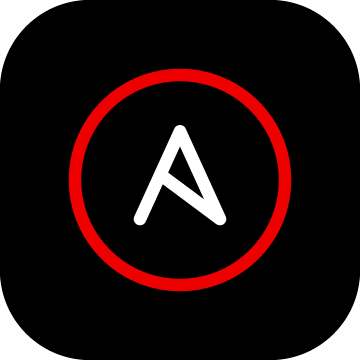
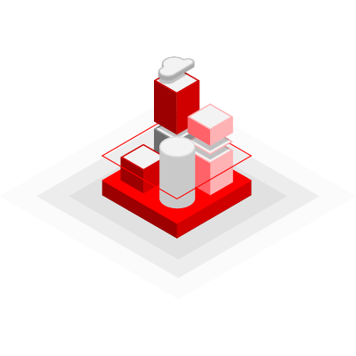
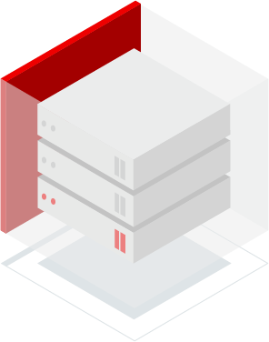
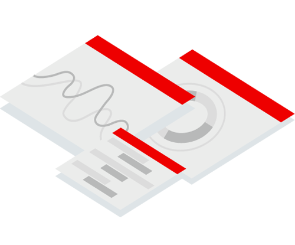

# Hi there, I'm Amarnath 

## A Geek, Gamer and an Automation Nerd !!

- 🔭 I’m working on gaining expertise on Ansible, Kubernetes, Docker and other DevOps Tools.
- 🌱 I’m currently learning Norwegians.
- 🥅 2024 Goals: Work out more. So far, not going well 🤣
- ⚡ Fun fact: I love animes and read lots of comics.

### Connect with me

&nbsp;&nbsp;

&nbsp;&nbsp;

### Aresenal:

#### Platforms:
##### Cloud

 
 

##### Red Hat

 
 

#### Languages

 
 

#### DevOps

 
 

#### Tools

 

 
 
 
 

---

### 📕 Latest Blog Posts

<!-- BLOG-POST-LIST:START -->
- [DevOps in My Daily Life](https://medium.com/@amarnathjamale/devops-in-my-daily-life-eb6c8e47e80d?source=rss-6803cab610d1------2)
<!-- BLOG-POST-LIST:END -->

➡️ [more blog posts...](https://medium.com/@amarnathjamale)

---

  
:zap: Recent GitHub Activity

<!--RECENT_ACTIVITY:start-->
1. ⬆️ Pushed 1 commit(s) to [amarnathjamale/amarnathjamale.github.io](https://github.com/amarnathjamale/amarnathjamale.github.io)
2. ⬆️ Pushed 1 commit(s) to [amarnathjamale/amarnathjamale.github.io](https://github.com/amarnathjamale/amarnathjamale.github.io)
3. ⬆️ Pushed 1 commit(s) to [amarnathjamale/amarnathjamale.github.io](https://github.com/amarnathjamale/amarnathjamale.github.io)
4. ⬆️ Pushed 1 commit(s) to [amarnathjamale/ansible-dev-setup](https://github.com/amarnathjamale/ansible-dev-setup)
5. ⭐ Starred [prasanthrangan/hyprdots](https://github.com/prasanthrangan/hyprdots)
<!--RECENT_ACTIVITY:end-->

<!--RECENT_ACTIVITY:last_update-->
Last Updated: Wednesday, June 12th, 2024, 9:11:22 PM
<!--RECENT_ACTIVITY:last_update_end-->

  
:zap: GitHub Stats

 
 

[twitter]: https://twitter.com/amarnathjamale
[instagram]: https://instagram.com/amarnathjamale
[linkedin]: https://linkedin.com/in/amarnathjamale

